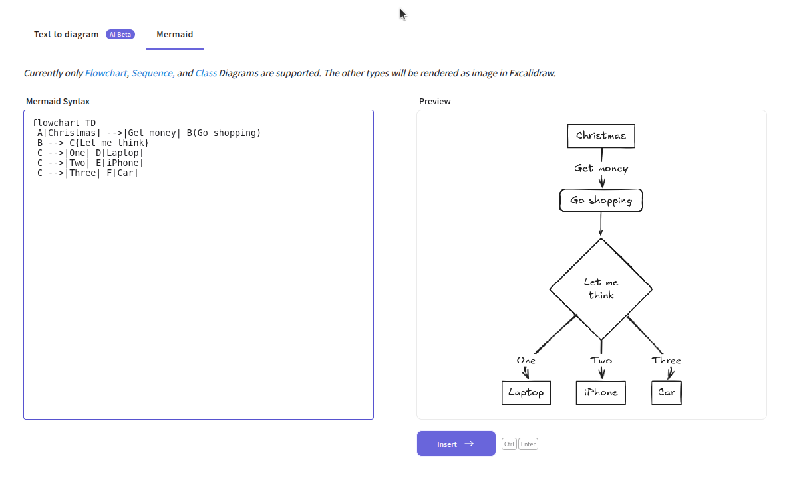

Creating flowcharts and diagrams with large language models (LLMs) is really easy. Combining [Excalidraw](https://excalidraw.com/) with text-based diagramming languages such as [Mermaid](https://mermaid.js.org/intro/), it's possible to quickly turn LLM-generated text into beautiful, editable flowcharts.

For most users, the simplest and most effective workflow will be to generate Mermaid diagrams with your LLM of choice, then convert them directly into Excalidraw using the built-in "Text to diagram" feature or the community’s Mermaid-to-Excalidraw converter:

Mermaid lets you describe flowcharts and other diagrams in plain text—a format LLMs are very good at producing. You can copy the Mermaid output from your LLM, paste it into the converter, and instantly get an editable Excalidraw diagram.

Excalidraw’s own "Text to diagram" feature (currently in beta) works the same way, but may use smaller, less capable models. For the best results, generate the Mermaid code yourself with a high-quality LLM and use the converter for full control and flexibility.
