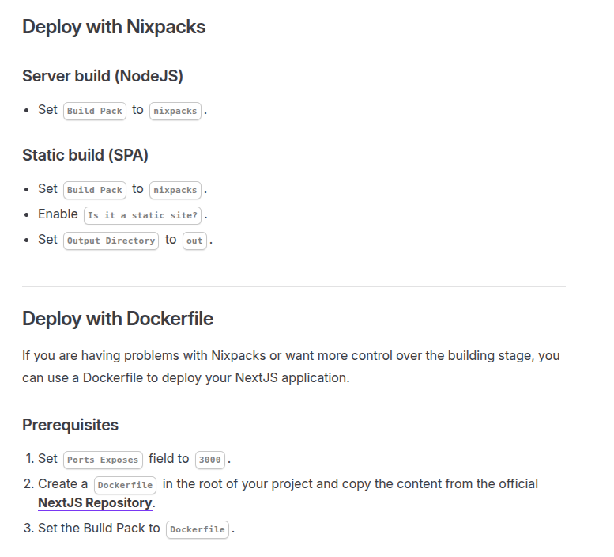

Coolify has become an increasingly popular self-hosted alternative to platforms like Vercel and Netlify, and given its popularity, I expect many people will be deploying their NextJS apps there. But should they?

Many will assume that NextJS can be treated the same way as any other containerised web application. In fact, that's what the Coolify docs would also imply...

While it may be tempting to follow these instructions without doing any more infrastructure work, there's an important caveat emptor to be aware of - and it all relates to React Server Components.

## The Server Components Problem

Modern Next.js applications heavily rely on React Server Components (RSCs). When you deploy a server component-based Next.js app to a basic Docker setup like Coolify, you're going to have much worse performance characteristics than even a traditional single page app. This is because server components require a completely different architecture than what most developers are used to (Single Page Applications).

When working with Single Page Applications (SPAs), the CDN (or origin server, if no CDN) is hit initially to download a large JS bundle. Subsequent page loads are lightning fast because UI rendering and interactivity all happens on the client-side.

To break this down:

1. User navigates to their first page e.g. /dashboard
2. Returns minimal HTML containing <script src="https://cdn.example.com/app.js">
3. Automatically requests app.js (triggered by the <script> tag)
4. Serves the JavaScript bundle
5. If additional data is required, then fetch this from the server
6. Return the data

On subsequent page loads, steps 1-4 never happen. The client-side router intercepts the navigation, the URL updates without page reload (History API), and DOM manipulation renders the new view.

This isn't the case for applications built around RSCs. When you build a Next.js app with server components, the rendering process looks like this:

To break this down:

1. User requests a page (e.g., `/dashboard`)
2. CDN checks if there's a cached version of this page (if cached, serve immediately, otherwise make a request to the server)
3. Return the pre-rendered HTML to the CDN.
4. Forward this to the client.
5. Request a small hydration bundle
6. Return this to the client.

The CDN here is **critical** for performance, even on subsequent page loads. Without it, every single page request including client-side navigations has to make a round trip to your server and users wait for the full server response before anything changes on screen. This is materially worse than an equivalent SPA, which even without a CDN layer, can respond instantly to user interactions (showing loading states immediately).

From personal testing of a little to-do app, these are the latency differences I can see. Although your mileage may vary a bit depending the application, caching strategies, server location, and content complexity, the difference should be stark:

**With CDN (Vercel/Netlify):**
- First page load: ~300ms
- Subsequent navigations: ~50ms (instant feeling)

**Without CDN (Coolify default):**
- First page load: ~800ms+ (including cold starts)
- Subsequent navigations: ~600ms+ (waiting for server response)

 Users expect navigation to feel snappy — typically under about 150ms for an "app-like" experience, but ideally under about 50ms to feel instant. When every click requires a server round trip, you're back to the old days of traditional multi-page web apps.

So what are your options?

### Option 1: Use a CDN
You can deploy your Next.js build to Coolify, put Cloudflare or another CDN in front of it, and configure proper caching headers. In practice, this is a bit fiddly, but it's the right way to go about things if your committed to a self-hosted approach. [Focus Reactive](https://focusreactive.com/configure-cdn-caching-for-self-hosted-next-js-websites/) has the most comprehensive guide I've seen on this.

### Option 2: Stick with Vercel/Netlify
Vercel and Netlify can handle the CDN layer automatically, Built-in optimizations for Next.js. For most applications people will be building, this is worth the cost, but it's important to be aware of vendor lock-in.

### Option 3: Accept the performance hit
Sometimes a simple deployment trumps performance. For internal tools, hobby projects, or low-traffic app, this is perfectly fine, but it's useful to at least know what you're signing up for.

## What to take away...

Coolify is a fantastic tool for self-hosting applications, but Next.js with server components has architectural requirements that go beyond simple container deployment. The CDN layer is technically optional, but it's fundamental to how these apps are designed to work. You *can* deploy to Coolify without a CDN, but you'll end up with an app that feels slower than older technologies.

If you're committed to self-hosting, invest in setting up a proper CDN layer. Your users (and your bounce rate) will thank you.